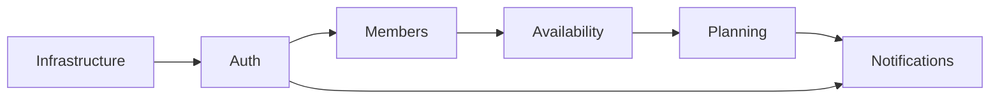

# Implementation Tasks: Church Team Management SaaS

**Branch**: `001-church-team-management` | **Generated**: 2025-12-27
**Plan**: [plan.md](plan.md) | **Spec**: [spec.md](spec.md) | **Data Model**: [data-model.md](data-model.md)

---

## Overview

Ce document contient toutes les tâches d'implémentation dérivées des 10 user stories de la spécification. Les tâches sont organisées par épic (user story), puis par phase technique (infrastructure, backend, frontend, tests).

**Estimation totale**: ~280 heures (35 jours développeur)

---

## Legend

| Symbole | Signification               |
| ------- | --------------------------- |
| 🔴      | Bloquant / Critical path    |
| 🟡      | Important mais non bloquant |
| 🟢      | Nice-to-have / Polish       |
| ⏱️      | Estimation en heures        |
| 📦      | Livrable / Artifact         |

---

## Epic 0: Infrastructure & Fondations

> **Prérequis avant toute user story**

### T0.1 - Configuration du monorepo ⏱️ 4h 🔴

- [x] **T0.1.1** Initialiser le repository avec structure `backend/` et `frontend/`
- [x] **T0.1.2** Créer `docker-compose.yml` avec PostgreSQL, Redis, Mailpit, MinIO
- [x] **T0.1.3** Configurer les fichiers `.env.example` pour backend et frontend
- [x] **T0.1.4** Créer le `Makefile` racine avec commandes unifiées
- [x] **T0.1.5** Configurer pre-commit hooks (ruff, eslint, prettier, commitlint)

📦 Repository prêt pour développement local

### T0.2 - Setup Backend FastAPI ⏱️ 6h 🔴

- [x] **T0.2.1** Initialiser projet Python avec `pyproject.toml` et `uv`
- [x] **T0.2.2** Créer structure Clean Architecture:
  ```
  app/api/v1/routes/
  app/core/
  app/services/
  app/repositories/
  app/models/
  app/schemas/
  ```
- [x] **T0.2.3** Configurer `app/core/config.py` avec Pydantic Settings
- [x] **T0.2.4** Configurer SQLAlchemy 2.0 async avec `app/core/database.py`
- [x] **T0.2.5** Configurer Alembic pour les migrations
- [x] **T0.2.6** Créer le fichier `app/main.py` avec CORS et middleware
- [x] **T0.2.7** Configurer logging JSON structuré avec correlation_id

📦 Backend FastAPI démarrant sans erreur

### T0.3 - Setup Frontend Next.js ⏱️ 6h 🔴

- [x] **T0.3.1** Initialiser projet Next.js 14+ avec App Router et TypeScript strict
- [x] **T0.3.2** Configurer TailwindCSS et Shadcn/ui
- [x] **T0.3.3** Créer structure dossiers:
  ```
  app/(auth)/
  app/(dashboard)/
  components/ui/
  lib/
  stores/
  hooks/
  types/
  ```
- [x] **T0.3.4** Configurer TanStack Query provider
- [x] **T0.3.5** Configurer Zustand store de base
- [x] **T0.3.6** Créer client API avec fetch wrapper et gestion erreurs
- [x] **T0.3.7** Configurer next-intl pour i18n (fr par défaut)

📦 Frontend Next.js démarrant sans erreur

### T0.4 - Base de données initiale ⏱️ 4h 🔴

- [x] **T0.4.1** Créer modèle `Organization` avec SQLAlchemy
- [x] **T0.4.2** Créer modèle `User` avec champs de base
- [x] **T0.4.3** Créer modèle `RefreshToken`
- [x] **T0.4.4** Générer migration initiale Alembic
- [x] **T0.4.5** Créer script de seed pour données de test
- [x] **T0.4.6** Tester la connexion DB et migrations

📦 Base de données avec tables User et Organization

### T0.5 - CI/CD Pipeline ⏱️ 4h 🟡

- [x] **T0.5.1** Créer workflow GitHub Actions pour tests backend
- [x] **T0.5.2** Créer workflow GitHub Actions pour tests frontend
- [x] **T0.5.3** Configurer coverage reports (Codecov ou similaire)
- [x] **T0.5.4** Créer workflow de lint sur chaque PR
- [x] **T0.5.5** Documenter le workflow de déploiement

📦 CI/CD fonctionnel sur chaque PR

---

## Epic 1: Inscription et Authentification (P1)

> **User Story 1** - FR-001 à FR-005

### T1.1 - Backend Auth Core ⏱️ 8h 🔴

- [x] **T1.1.1** Créer `app/core/security.py`:
  - Hashing bcrypt pour passwords
  - Génération JWT avec python-jose
  - Validation tokens
- [x] **T1.1.2** Créer `app/schemas/auth.py`:
  - `RegisterRequest`, `LoginRequest`, `AuthResponse`
  - `TokenPayload`, `RefreshTokenRequest`
- [x] **T1.1.3** Créer `app/repositories/user_repository.py`:
  - `create()`, `get_by_email()`, `get_by_id()`, `update()`
- [x] **T1.1.4** Créer `app/services/auth_service.py`:
  - `register()`, `login()`, `refresh_token()`, `logout()`
  - `forgot_password()`, `reset_password()`
- [x] **T1.1.5** Créer `app/api/v1/routes/auth.py`:
  - POST `/auth/register`
  - POST `/auth/login`
  - POST `/auth/refresh`
  - POST `/auth/logout`
  - POST `/auth/forgot-password`
  - POST `/auth/reset-password`
- [ ] **T1.1.6** Créer middleware d'authentification `get_current_user`

📦 Endpoints auth fonctionnels avec JWT

### T1.2 - Backend OAuth Google ⏱️ 4h 🟡

- [ ] **T1.2.1** Configurer variables OAuth (GOOGLE_CLIENT_ID, etc.)
- [ ] **T1.2.2** Créer endpoint POST `/auth/google` pour valider id_token
- [ ] **T1.2.3** Créer ou lier compte utilisateur depuis profil Google
- [ ] **T1.2.4** Générer JWT après validation OAuth

📦 Connexion Google fonctionnelle

### T1.3 - Backend Email Service ⏱️ 4h 🔴

- [ ] **T1.3.1** Configurer FastAPI-Mail avec SMTP settings
- [ ] **T1.3.2** Créer templates Jinja2:
  - `email_verification.html`
  - `password_reset.html`
- [ ] **T1.3.3** Créer `app/services/email_service.py`:
  - `send_verification_email()`
  - `send_password_reset_email()`
- [ ] **T1.3.4** Intégrer Celery pour envoi async des emails

📦 Emails transactionnels envoyés

### T1.4 - Frontend Auth UI ⏱️ 10h 🔴

- [ ] **T1.4.1** Configurer Better Auth avec providers (credentials, google)
- [ ] **T1.4.2** Créer page `app/(auth)/login/page.tsx`:
  - Formulaire email/password avec React Hook Form + Zod
  - Bouton "Se connecter avec Google"
  - Lien "Mot de passe oublié"
- [ ] **T1.4.3** Créer page `app/(auth)/register/page.tsx`:
  - Formulaire inscription
  - Validation temps réel (email unique, force password)
- [ ] **T1.4.4** Créer page `app/(auth)/forgot-password/page.tsx`
- [ ] **T1.4.5** Créer page `app/(auth)/reset-password/page.tsx`
- [ ] **T1.4.6** Créer `stores/auth.ts` avec Zustand:
  - State: user, accessToken, isAuthenticated
  - Actions: login, logout, refreshToken
- [ ] **T1.4.7** Créer hook `useAuth()` et provider
- [ ] **T1.4.8** Implémenter refresh token automatique

📦 Flow auth complet côté client

### T1.5 - Backend User Profile ⏱️ 4h 🟡

- [ ] **T1.5.1** Créer `app/api/v1/routes/users.py`:
  - GET `/users/me`
  - PATCH `/users/me`
  - DELETE `/users/me` (soft delete, RGPD)
- [ ] **T1.5.2** Créer endpoint GET `/users/me/data-export` (RGPD)
- [ ] **T1.5.3** Implémenter upload avatar vers S3

📦 Gestion profil utilisateur

### T1.6 - Tests Auth ⏱️ 6h 🔴

- [ ] **T1.6.1** Tests unitaires `auth_service.py` (pytest)
- [ ] **T1.6.2** Tests intégration endpoints auth
- [ ] **T1.6.3** Tests e2e flow inscription/connexion (Playwright)
- [ ] **T1.6.4** Tests sécurité: brute force, token expiration

📦 Coverage ≥ 80% sur module auth

---

## Epic 2: Saisie des Indisponibilités (P1)

> **User Story 2** - FR-010

### T2.1 - Backend Availability Model ⏱️ 4h 🔴

- [ ] **T2.1.1** Créer modèle `Department` SQLAlchemy
- [ ] **T2.1.2** Créer modèle `Member` (relation User-Department)
- [ ] **T2.1.3** Créer modèle `Availability` avec contraintes
- [ ] **T2.1.4** Générer migration Alembic
- [ ] **T2.1.5** Créer index sur (member_id, date)

📦 Tables Department, Member, Availability créées

### T2.2 - Backend Availability API ⏱️ 6h 🔴

- [ ] **T2.2.1** Créer `app/repositories/availability_repository.py`
- [ ] **T2.2.2** Créer `app/services/availability_service.py`:
  - `set_availabilities(member_id, month, dates)`
  - `get_member_availabilities(member_id, month)`
  - `get_department_availabilities(dept_id, month)`
  - `check_deadline(dept_id, month)`
- [ ] **T2.2.3** Créer `app/api/v1/routes/availabilities.py`:
  - GET `/departments/{id}/availabilities?month=`
  - PUT `/departments/{id}/members/me/availabilities`
- [ ] **T2.2.4** Implémenter validation deadline (403 si dépassée)

📦 API indisponibilités fonctionnelle

### T2.3 - Frontend Availability UI ⏱️ 8h 🔴

- [ ] **T2.3.1** Créer composant `AvailabilityCalendar`:
  - Vue mois avec sélection multiple
  - Jours sélectionnés en surbrillance
  - Indication jours passés (non-sélectionnables)
- [ ] **T2.3.2** Créer page `app/(dashboard)/availability/page.tsx`:
  - Navigation mois précédent/suivant
  - Bouton "Enregistrer"
  - Message deadline si dépassée
- [ ] **T2.3.3** Intégrer TanStack Query pour sync données
- [ ] **T2.3.4** Ajouter optimistic updates sur sélection

📦 Interface saisie indisponibilités

### T2.4 - WebSocket Availability Updates ⏱️ 4h 🟡

- [ ] **T2.4.1** Configurer python-socketio avec Redis adapter
- [ ] **T2.4.2** Émettre événement `availability:updated` sur modification
- [ ] **T2.4.3** Configurer Socket.io-client côté frontend
- [ ] **T2.4.4** Notifier responsable des modifications

📦 Updates temps réel fonctionnels

### T2.5 - Tests Availability ⏱️ 4h 🔴

- [ ] **T2.5.1** Tests unitaires service availability
- [ ] **T2.5.2** Tests intégration API
- [ ] **T2.5.3** Tests composant calendrier (Vitest + Testing Library)

📦 Coverage ≥ 80% sur module availability

---

## Epic 3: Génération et Publication du Planning (P1)

> **User Story 3** - FR-011 à FR-015

### T3.1 - Backend Planning Models ⏱️ 4h 🔴

- [ ] **T3.1.1** Créer modèle `Service` (événement/culte)
- [ ] **T3.1.2** Créer modèle `Planning` (mois, status, etc.)
- [ ] **T3.1.3** Créer modèle `PlanningAssignment`
- [ ] **T3.1.4** Générer migration Alembic
- [ ] **T3.1.5** Créer enum `PlanningStatus`

📦 Tables Planning, Service, PlanningAssignment

### T3.2 - Backend Planning Generator ⏱️ 12h 🔴

- [ ] **T3.2.1** Créer `app/services/planning_generator.py`:
  - Algorithme greedy avec scoring pondéré
  - Calcul score équité (historique participations)
  - Calcul score compétences (match requis)
  - Détection conflits (aucun disponible)
- [ ] **T3.2.2** Créer tâche Celery `generate_planning_task`
- [ ] **T3.2.3** Implémenter progress tracking (Redis)
- [ ] **T3.2.4** Calculer confidence_score du planning
- [ ] **T3.2.5** Gérer les cas edge (aucun membre dispo)

📦 Algorithme de génération fonctionnel

### T3.3 - Backend Planning API ⏱️ 8h 🔴

- [ ] **T3.3.1** Créer `app/repositories/planning_repository.py`
- [ ] **T3.3.2** Créer `app/services/planning_service.py`
- [ ] **T3.3.3** Créer `app/api/v1/routes/plannings.py`:
  - GET `/departments/{id}/plannings`
  - POST `/departments/{id}/plannings` (create draft)
  - GET `/departments/{id}/plannings/{id}`
  - POST `/departments/{id}/plannings/{id}/generate`
  - POST `/departments/{id}/plannings/{id}/publish`
  - POST `/departments/{id}/plannings/{id}/assignments`
- [ ] **T3.3.4** Créer endpoints Services CRUD

📦 API planning complète

### T3.4 - Backend Planning Export ⏱️ 4h 🟡

- [ ] **T3.4.1** Implémenter export PDF (WeasyPrint ou ReportLab)
- [ ] **T3.4.2** Implémenter export iCal (icalendar)
- [ ] **T3.4.3** Endpoint GET `/plannings/{id}/export?format=pdf|ical`

📦 Export PDF et iCal

### T3.5 - Frontend Planning Views ⏱️ 12h 🔴

- [ ] **T3.5.1** Créer composant `PlanningGrid`:
  - Vue tableau services x membres
  - Drag & drop pour réaffectation
  - Indicateurs de conflits
- [ ] **T3.5.2** Créer page `app/(dashboard)/plannings/page.tsx`:
  - Liste des plannings par mois
  - Status badges (draft, published)
- [ ] **T3.5.3** Créer page `app/(dashboard)/plannings/[id]/page.tsx`:
  - Affichage grille planning
  - Boutons Generate / Publish
  - Panel détails service
- [ ] **T3.5.4** Créer page `app/(dashboard)/plannings/[id]/edit/page.tsx`:
  - Mode édition avec drag & drop
- [ ] **T3.5.5** Implémenter vue "Mon planning" pour membres

📦 Interface planning complète

### T3.6 - WebSocket Planning Collaboration ⏱️ 6h 🟡

- [ ] **T3.6.1** Événement `planning:generation:progress`
- [ ] **T3.6.2** Événement `planning:assignment:updated`
- [ ] **T3.6.3** Événement `planning:published`
- [ ] **T3.6.4** Afficher curseurs autres utilisateurs (presence)

📦 Édition collaborative temps réel

### T3.7 - Tests Planning ⏱️ 8h 🔴

- [ ] **T3.7.1** Tests unitaires algorithme de génération
- [ ] **T3.7.2** Tests scénarios: tous dispo, aucun dispo, partiels
- [ ] **T3.7.3** Tests intégration API planning
- [ ] **T3.7.4** Tests e2e flow génération → publication

📦 Coverage ≥ 80% sur module planning

---

## Epic 4: Gestion des Membres du Département (P2)

> **User Story 4** - FR-006 à FR-009

### T4.1 - Backend Department & Members ⏱️ 6h 🔴

- [ ] **T4.1.1** Créer modèle `Invitation` avec token et expiration
- [ ] **T4.1.2** Créer `app/repositories/department_repository.py`
- [ ] **T4.1.3** Créer `app/repositories/member_repository.py`
- [ ] **T4.1.4** Créer `app/services/department_service.py`
- [ ] **T4.1.5** Créer `app/services/invitation_service.py`

📦 Services département et membres

### T4.2 - Backend Department API ⏱️ 6h 🔴

- [ ] **T4.2.1** Créer `app/api/v1/routes/departments.py`:
  - CRUD départements
  - Validation organization_id isolation
- [ ] **T4.2.2** Créer `app/api/v1/routes/members.py`:
  - GET `/departments/{id}/members`
  - POST `/departments/{id}/invitations`
  - POST `/invitations/{token}/accept`
  - PATCH `/departments/{id}/members/{id}`
  - DELETE `/departments/{id}/members/{id}`
- [ ] **T4.2.3** Implémenter envoi email invitation

📦 API membres complète

### T4.3 - Frontend Members UI ⏱️ 8h 🔴

- [ ] **T4.3.1** Créer page `app/(dashboard)/team/page.tsx`:
  - Liste membres avec avatar, rôle, skills
  - Invitations en attente
  - Bouton "Inviter"
- [ ] **T4.3.2** Créer composant `InviteMemberModal`
- [ ] **T4.3.3** Créer composant `MemberCard` avec actions
- [ ] **T4.3.4** Créer page `app/(auth)/invitation/[token]/page.tsx`
- [ ] **T4.3.5** Créer composant `SkillsEditor` (tags)

📦 Interface gestion équipe

### T4.4 - Tests Members ⏱️ 4h 🔴

- [ ] **T4.4.1** Tests invitation flow
- [ ] **T4.4.2** Tests permissions (seul admin peut inviter)
- [ ] **T4.4.3** Tests isolation multi-tenant

📦 Coverage ≥ 80% sur module members

---

## Epic 5: Notifications et Rappels (P2)

> **User Story 5** - FR-024 à FR-026

### T5.1 - Backend Notification System ⏱️ 8h 🔴

- [ ] **T5.1.1** Créer modèle `Notification` SQLAlchemy
- [ ] **T5.1.2** Créer `app/services/notification_service.py`:
  - `create_notification(user_id, type, data)`
  - `mark_as_read(notification_id)`
  - `get_user_notifications(user_id)`
- [ ] **T5.1.3** Créer types de notification enum
- [ ] **T5.1.4** Créer `app/api/v1/routes/notifications.py`

📦 API notifications

### T5.2 - Backend Notification Triggers ⏱️ 6h 🔴

- [ ] **T5.2.1** Trigger: planning publié → notifier membres
- [ ] **T5.2.2** Trigger: nouvelle affectation → notifier membre
- [ ] **T5.2.3** Trigger: membre rejoint → notifier admin
- [ ] **T5.2.4** Créer tâche Celery `send_service_reminders`
- [ ] **T5.2.5** Configurer Celery Beat pour rappels 24h avant

📦 Triggers notifications automatiques

### T5.3 - Backend Email Notifications ⏱️ 4h 🟡

- [ ] **T5.3.1** Créer templates email pour chaque type
- [ ] **T5.3.2** Respecter préférences utilisateur
- [ ] **T5.3.3** Implémenter unsubscribe link

📦 Emails notifications

### T5.4 - WebSocket Notifications ⏱️ 4h 🔴

- [ ] **T5.4.1** Room `user:{user_id}` pour notifications privées
- [ ] **T5.4.2** Événement `notification:new`
- [ ] **T5.4.3** Événement `notification:count` (badge)

📦 Notifications temps réel

### T5.5 - Frontend Notifications UI ⏱️ 6h 🔴

- [ ] **T5.5.1** Créer composant `NotificationBell` (header)
- [ ] **T5.5.2** Créer composant `NotificationDropdown`
- [ ] **T5.5.3** Créer page `app/(dashboard)/notifications/page.tsx`
- [ ] **T5.5.4** Créer page préférences notifications
- [ ] **T5.5.5** Intégrer Web Push API (optionnel)

📦 Interface notifications

### T5.6 - Tests Notifications ⏱️ 4h 🔴

- [ ] **T5.6.1** Tests triggers notifications
- [ ] **T5.6.2** Tests préférences utilisateur
- [ ] **T5.6.3** Tests WebSocket notifications

📦 Coverage ≥ 80% sur module notifications

---

## Epic 6: Gestion du Code Vestimentaire (P3)

> **User Story 6** - FR-016, FR-017

### T6.1 - Backend DressCode ⏱️ 4h 🟡

- [ ] **T6.1.1** Créer modèle `DressCode` SQLAlchemy
- [ ] **T6.1.2** Créer repository et service
- [ ] **T6.1.3** Créer `app/api/v1/routes/dress_codes.py` CRUD
- [ ] **T6.1.4** Implémenter upload images vers S3
- [ ] **T6.1.5** Lier dress_code_id aux Services

📦 API dress codes

### T6.2 - Frontend DressCode UI ⏱️ 4h 🟡

- [ ] **T6.2.1** Créer page `app/(dashboard)/dress-codes/page.tsx`
- [ ] **T6.2.2** Créer composant `DressCodeCard` avec images
- [ ] **T6.2.3** Créer modal création/édition
- [ ] **T6.2.4** Afficher dress code sur détail service

📦 Interface dress codes

### T6.3 - Tests DressCode ⏱️ 2h 🟡

- [ ] **T6.3.1** Tests CRUD API
- [ ] **T6.3.2** Tests upload images

📦 Coverage module dress-codes

---

## Epic 7: Comptes-Rendus de Service (P3)

> **User Story 7** - FR-018 à FR-020

### T7.1 - Backend Reports ⏱️ 4h 🟡

- [ ] **T7.1.1** Créer modèle `ServiceReport`
- [ ] **T7.1.2** Créer repository et service
- [ ] **T7.1.3** Créer `app/api/v1/routes/reports.py`
- [ ] **T7.1.4** Implémenter recherche par date/service
- [ ] **T7.1.5** Gérer upload photos multiples

📦 API rapports

### T7.2 - Frontend Reports UI ⏱️ 6h 🟡

- [ ] **T7.2.1** Créer page `app/(dashboard)/reports/page.tsx`
- [ ] **T7.2.2** Créer composant `ReportForm`
- [ ] **T7.2.3** Créer composant `ReportCard`
- [ ] **T7.2.4** Créer page détail rapport
- [ ] **T7.2.5** Implémenter filtres recherche

📦 Interface rapports

### T7.3 - Tests Reports ⏱️ 2h 🟡

- [ ] **T7.3.1** Tests CRUD API
- [ ] **T7.3.2** Tests recherche

📦 Coverage module reports

---

## Epic 8: Gestion de l'Inventaire (P3)

> **User Story 8** - FR-021 à FR-023

### T8.1 - Backend Inventory ⏱️ 4h 🟡

- [ ] **T8.1.1** Créer modèle `InventoryItem` avec enums condition
- [ ] **T8.1.2** Créer repository et service
- [ ] **T8.1.3** Créer `app/api/v1/routes/inventory.py`
- [ ] **T8.1.4** Implémenter alertes condition "needs_repair"
- [ ] **T8.1.5** Gérer attribution temporaire

📦 API inventaire

### T8.2 - Frontend Inventory UI ⏱️ 6h 🟡

- [ ] **T8.2.1** Créer page `app/(dashboard)/inventory/page.tsx`
- [ ] **T8.2.2** Créer composant `InventoryTable` avec filtres
- [ ] **T8.2.3** Créer modal ajout/édition article
- [ ] **T8.2.4** Créer composant `ConditionBadge`

📦 Interface inventaire

### T8.3 - Tests Inventory ⏱️ 2h 🟡

- [ ] **T8.3.1** Tests CRUD API
- [ ] **T8.3.2** Tests alertes

📦 Coverage module inventory

---

## Epic 9: Calendrier des Dates Importantes (P4)

> **User Story 9**

### T9.1 - Backend Events ⏱️ 3h 🟢

- [ ] **T9.1.1** Créer modèle `Event` (birthday, trip, holiday)
- [ ] **T9.1.2** Créer repository et service
- [ ] **T9.1.3** Créer `app/api/v1/routes/events.py`

📦 API événements

### T9.2 - Frontend Events UI ⏱️ 4h 🟢

- [ ] **T9.2.1** Créer page `app/(dashboard)/calendar/page.tsx`
- [ ] **T9.2.2** Intégrer composant calendrier
- [ ] **T9.2.3** Afficher événements avec couleurs par type
- [ ] **T9.2.4** Widget anniversaires sur dashboard

📦 Interface calendrier

---

## Epic 10: Liste de Courses Partagée (P4)

> **User Story 10**

### T10.1 - Backend Shopping Lists ⏱️ 4h 🟢

- [ ] **T10.1.1** Créer modèles `ShoppingList` et `ShoppingItem`
- [ ] **T10.1.2** Créer repository et service
- [ ] **T10.1.3** Créer `app/api/v1/routes/shopping_lists.py`
- [ ] **T10.1.4** Implémenter mark as purchased

📦 API shopping lists

### T10.2 - WebSocket Shopping Updates ⏱️ 2h 🟢

- [ ] **T10.2.1** Événement `shopping:item:added`
- [ ] **T10.2.2** Événement `shopping:item:purchased`

📦 Updates temps réel shopping

### T10.3 - Frontend Shopping UI ⏱️ 4h 🟢

- [ ] **T10.3.1** Créer page `app/(dashboard)/shopping/page.tsx`
- [ ] **T10.3.2** Créer composant `ShoppingListCard`
- [ ] **T10.3.3** Créer composant `ShoppingItemRow`
- [ ] **T10.3.4** Animations check/uncheck

📦 Interface listes de courses

---

## Epic 11: Dashboard & Polish

### T11.1 - Dashboard Principal ⏱️ 6h 🟡

- [ ] **T11.1.1** Créer page `app/(dashboard)/page.tsx`:
  - Prochains services de l'utilisateur
  - Notifications récentes
  - Raccourcis actions fréquentes
- [ ] **T11.1.2** Créer widgets dashboard personnalisables
- [ ] **T11.1.3** Vue responsive mobile

📦 Dashboard principal

### T11.2 - Polish & Accessibilité ⏱️ 4h 🟢

- [ ] **T11.2.1** Audit accessibilité WCAG 2.1 AA
- [ ] **T11.2.2** Keyboard navigation
- [ ] **T11.2.3** Screen reader support
- [ ] **T11.2.4** Dark mode support

📦 Application accessible

### T11.3 - Performance Optimization ⏱️ 4h 🟢

- [ ] **T11.3.1** Lazy loading routes et composants
- [ ] **T11.3.2** Image optimization (next/image)
- [ ] **T11.3.3** Bundle analysis et tree-shaking
- [ ] **T11.3.4** Audit Lighthouse > 90

📦 Performance optimisée

---

## Summary by Priority

| Priority   | Epic           | Tasks       | Hours |
| ---------- | -------------- | ----------- | ----- |
| **P0**     | Infrastructure | T0.1-T0.5   | 24h   |
| **P1**     | Auth           | T1.1-T1.6   | 36h   |
| **P1**     | Availability   | T2.1-T2.5   | 26h   |
| **P1**     | Planning       | T3.1-T3.7   | 54h   |
| **P2**     | Members        | T4.1-T4.4   | 24h   |
| **P2**     | Notifications  | T5.1-T5.6   | 32h   |
| **P3**     | DressCode      | T6.1-T6.3   | 10h   |
| **P3**     | Reports        | T7.1-T7.3   | 12h   |
| **P3**     | Inventory      | T8.1-T8.3   | 12h   |
| **P4**     | Events         | T9.1-T9.2   | 7h    |
| **P4**     | Shopping       | T10.1-T10.3 | 10h   |
| **Polish** | Dashboard      | T11.1-T11.3 | 14h   |

**Total estimé**: ~261 heures

---

## Critical Path



**MVP Minimal** (P0 + P1): ~140 heures
**MVP Complet** (+ P2): ~196 heures
**Full Release** (+ P3 + P4): ~261 heures
